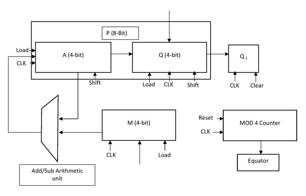
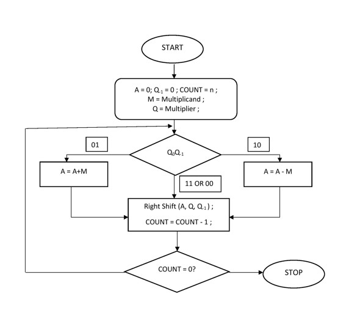

# iiitb_r2_4bit_bm -> Radix-2 4-Bit Booth's Multiplier

## Description

This project simulates the Radix-2 4-Bit Booth's Multiplier using Verilog HDL. It can be used to multiply two 4-bit binary signed number in a efficient manner with less number of addition operation. 

## Introduction

Booth's Multiplier is based on Booth's Multiplication Algorithm. It proposes an efficient way for multiplying two signed intergers in there 2's complement form such that the number of partial products is reduced which ultimately lead to the reduction of number of addition operation required for generating the final result.

## Application

Booth's Multiplier can be found to have wide application in field of Digital Signal Processing such as

* They can be used as a fundamental unit for MAC block.
* They can be used in filters like FIR and IIR.
* They can be used in Processing Element of Systolic Array. 

 They can basically be used in any application requiring high speed multiplcaition. 
 
 ## Block Diagram 
 
The Booth's Multiplier perform iterations of shift, addition and subtraction operation in order to produce the result.
 
 
 
As shown in the Block Diagram, Q and M are 4-bit registers that stores the multiplier and multipliicand respectively. It also consist of a 4-bit arthematic unit capable of performing both addition and subtractions. A MOD-4 counter is also present in order to keep track of shifting operation. A and Q are 4-bit shift register. The product is produced in 8_bit register P.  

## Working 

The  multiplication operation through Booth’s algorithm is efficient compared to traditional shift and multiplication process because it produces the result with lesser addition operation. 

The figure 1 shows the flowchart of Booth’s Algorithm. At every clock cycle the two bits (Q0, Q-1)  are inspected for determination of operation .The Q0 refers to Q[0]. If the (Q, Q-1) are same (1,1) 0r (0,0) then only right shift operation is performed. If the (Q0, Q-1) are same (1,0) then subtraction (A-M) followed by right shift is performed. If the (Q0, Q-1) are same (0,1) then addition (A+M) followed by right shift operation is performed. This cycle is repeated as many times as the specified bits of Booth’s Multiplier is given. This selectivity in performing addition /subtraction operation enables it to produce result efficiently. 

 
